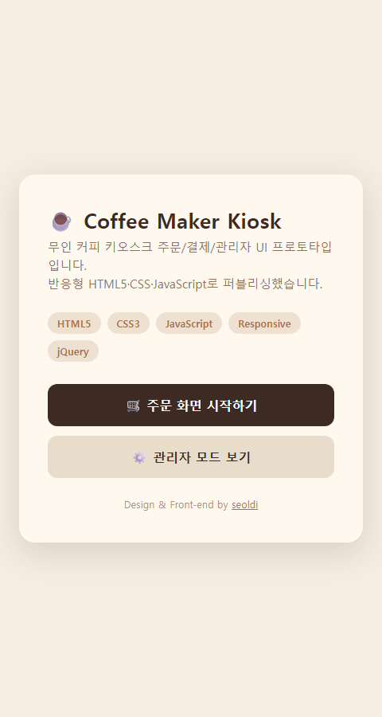
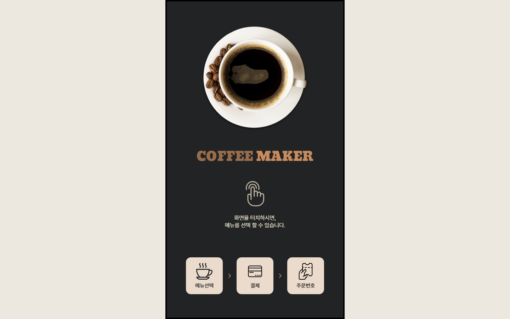
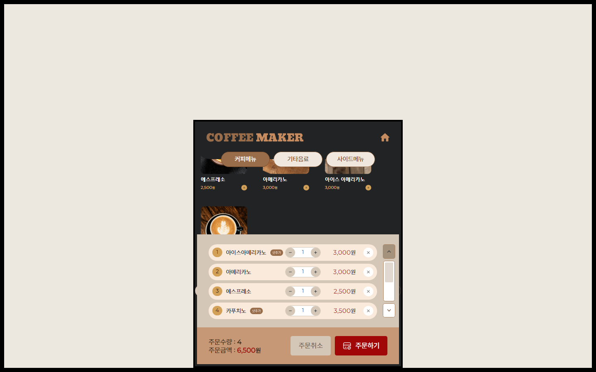
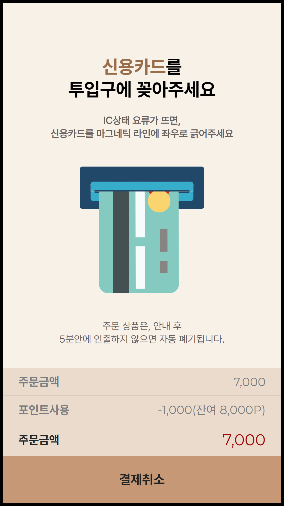
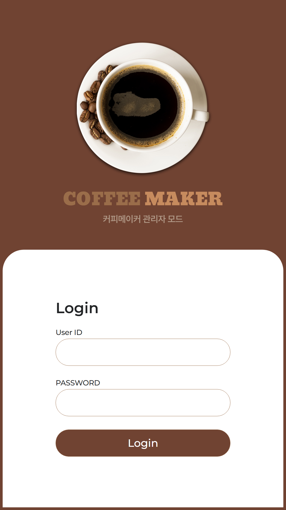
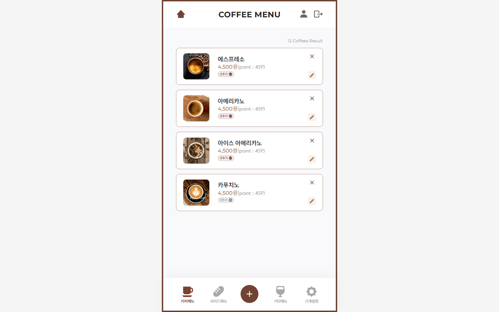

# ☕ Coffee Maker Kiosk

<a href="https://seoldi.github.io/coffee-maker-kiosk/demo.html" target="_blank">👉 주문 화면 데모</a> &nbsp;|&nbsp;
<a href="https://seoldi.github.io/coffee-maker-kiosk/demo.html?src=admin_intro" target="_blank">⚙️ 관리자 모드 데모</a>

---

## 📸 Screenshots

### 고객용 키오스크 · Customer Kiosk

| Landing | Order Start | Menu & Cart | Card Payment |
|:---:|:---:|:---:|:---:|
|  |  |  |  |

### 관리자 패널 · Admin Panel

| Login | Menu Management |
|:---:|:---:|
|  |  |

---

실제 클라이언트 프로젝트로 제작한 무인 커피 키오스크 UI 프로토타입입니다.  
1080×1920px 세로형 고객 키오스크와 모바일 최적화 관리자 패널을 포함합니다.

### 주요 기능

**고객용 키오스크**
- 회원/비회원 선택 → 휴대폰 번호 입력 → 회원가입 흐름
- 커피·기타음료·사이드메뉴 3개 카테고리 탐색
- 샷 추가 업셀 팝업 모달, 실시간 장바구니 반영
- 포인트 적립·사용 (키패드 입력)
- 신용카드 결제 → 영수증·번호표 출력
- 상품 매진 안내, 카드 환불 흐름

**관리자 패널**
- 관리자 로그인 및 사용자 정보 관리
- 메뉴 CRUD (이미지 업로드, 가격·포인트·재고 설정)
- 기기 설정 (코드 번호 슬롯 할당)

### 스택
- HTML5 / CSS3 / JavaScript (jQuery, jQuery Modal)
- 폰트: Pretendard (한글), Montserrat (영문)
- `demo.html` — iframe + `transform: scale` 데모 래퍼, 키오스크 소스 파일 무변경

### 담당 업무
UI/UX 디자인 및 프론트엔드 퍼블리싱 전담 (1인). 화면 흐름 기획, 컴포넌트 설계, 전 화면 동작하는 정적 프로토타입 구현까지 단독 진행.

---

An interactive kiosk UI prototype built for a real client — covers the full customer order flow and a complete admin panel.  
1080×1920px portrait canvas for customers; mobile-optimized layout for admin.

### Features

**Customer Kiosk**
- Member or guest checkout with phone number input and sign-up flow
- 3-category menu browsing: Coffee · Other Drinks · Side Menu
- Shot add-on popup modal (upsell), real-time cart update
- Points earn & redeem with on-screen keypad
- Credit card payment → receipt & order number display
- Sold-out handling, card refund flow

**Admin Panel**
- Admin login and profile management
- Menu CRUD — image upload, price / points / stock configuration
- Machine settings with numbered slot assignment

### Stack
- HTML5 / CSS3 / JavaScript (jQuery, jQuery Modal)
- Fonts: Pretendard (KR), Montserrat (EN)
- `demo.html` — iframe + `transform: scale` viewer; kiosk source files untouched

### Role
Sole designer and front-end developer. Responsible for the full process — UX flow planning, component design, and delivering a fully interactive static prototype.
